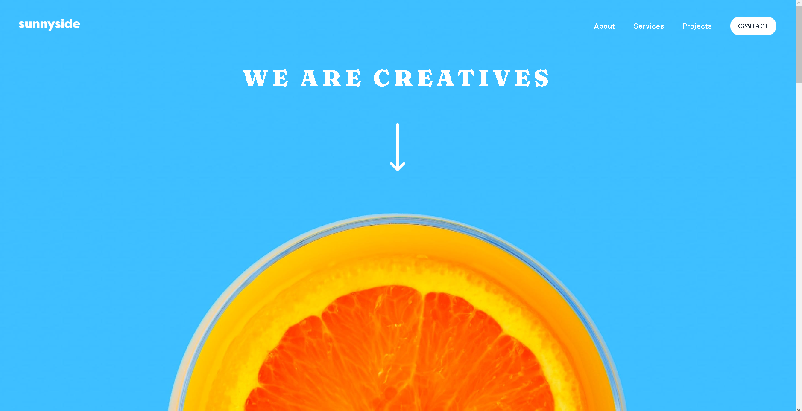
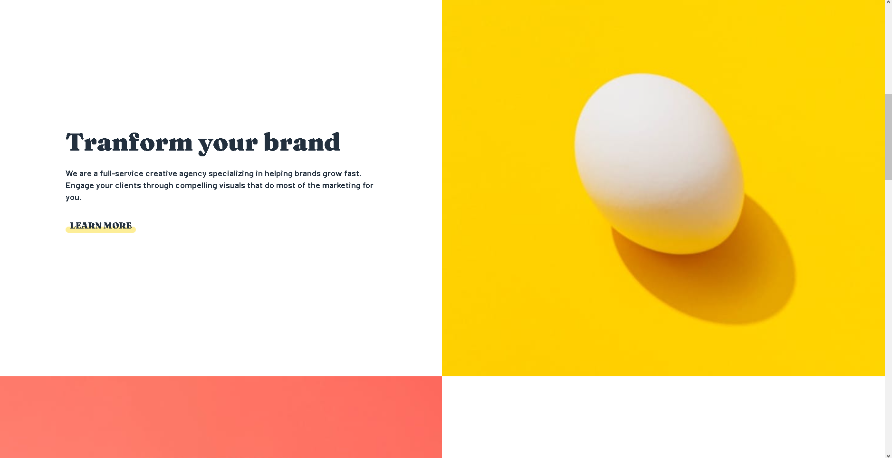
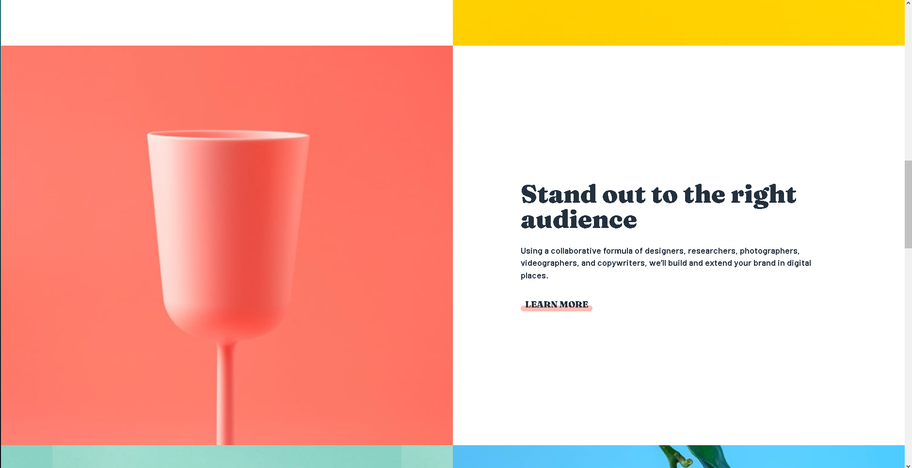
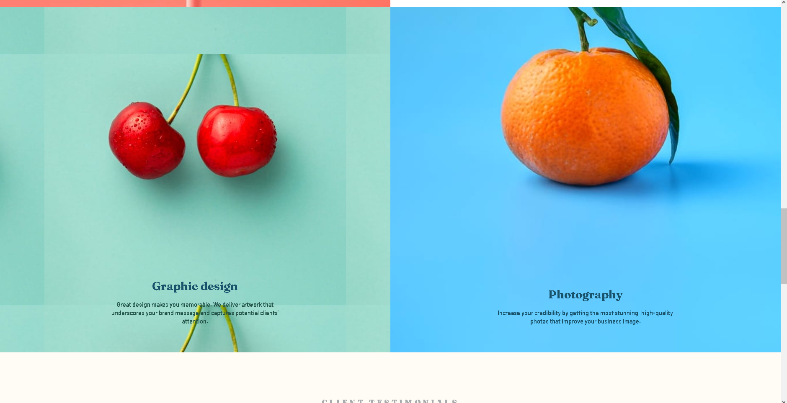
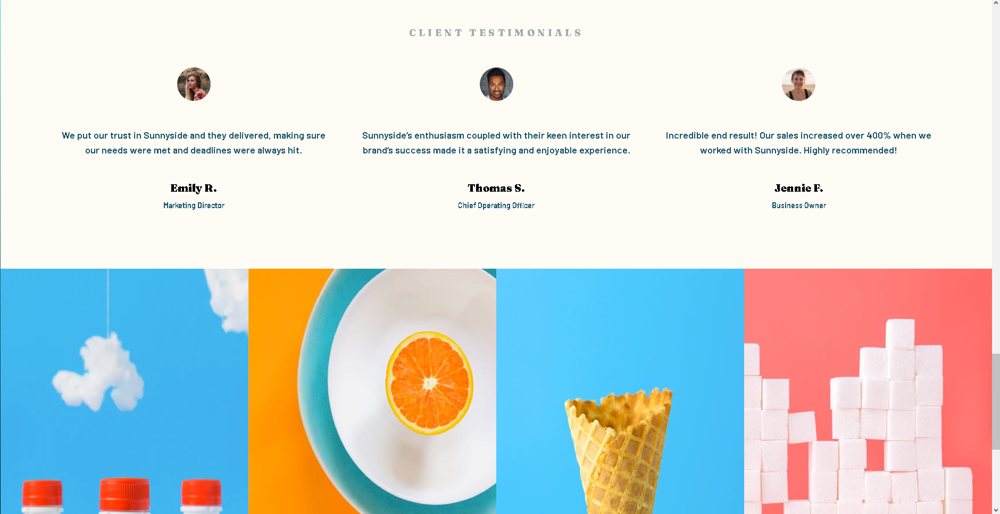
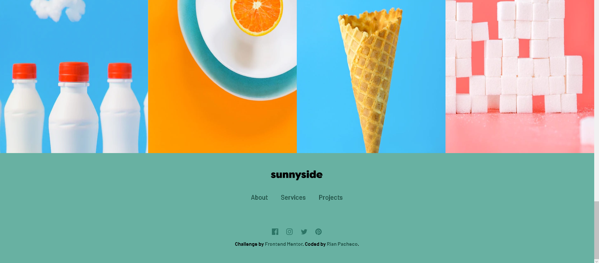
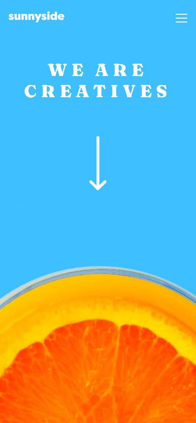
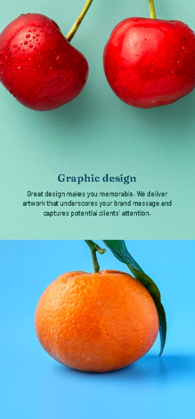
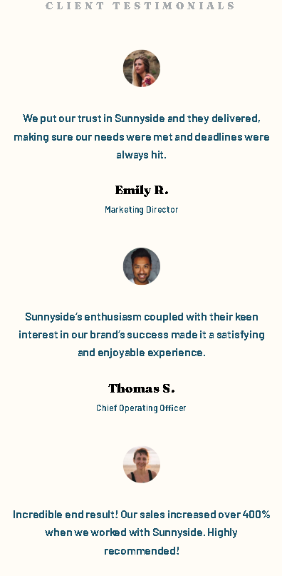
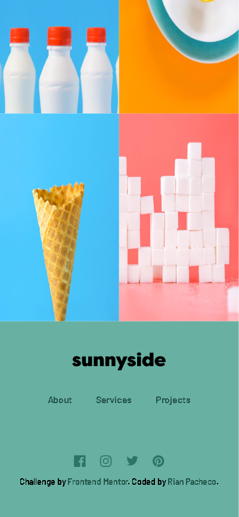

# Frontend Mentor - mestre da página de destino da agência sunnyside Ⓒ Rian Pacheco

### link do projeto - https://rianpacheco.github.io/sunnyside-agency-landing-page-master

 Projeto feito 100% para didática e colocar em pratica as tecnologias em front-end.

 Projeto feito do Desafio do Frontend Mentor.

## Preview Desktop

## Preview Mobile

# Tecnologias utilizadas

## Front end
- HTML
- CSS
- JAVASCRIPT

## Implantação em produção
- Front end web: GitHub.Io

# Autor

&copy; <a href="https://www.linkedin.com/in/rian-pacheco/"> Rian Pacheco</a>
